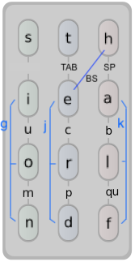
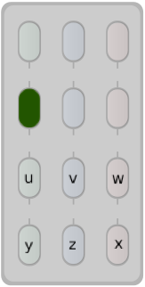
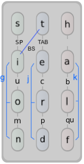
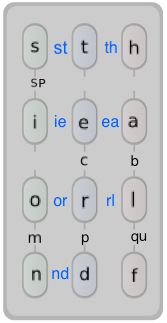
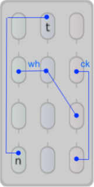
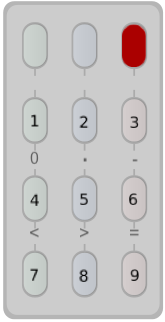

# slickr-layout
Keyboard layout design for the Twiddler3 that exploits row chording for faster, slicker typing.

Background
==========

On March 2019, Tek Gear quietly released _row chording_ as an experimental feature for the Twiddler3. This ability to press keys on the same row is a game changer, as it significantly increases the number of chord combinations one can enter. As a rough analogy, the added dexterity is as revolutionary as our pre-human ancestors evolving an opposable thumb.

What's the big deal? With row chording, you gain __3 extra chords per row__[1](#footnote1) 

        (LM), (MR), (LMR)

for a total of 12 more chords on the 3x4 keypad. If you're willing to invest time training your fingers, you can even combine row chords with keystrokes in other columns to create more complex combinations.

So I began to wonder: how can one create a (hopefully) faster, more expressive and fluid layout design that exploits the power of row chording? *Slickr* is my work-in-progress answer. 

Design Philosophy
-----------------

In designing Slickr, I looked at the four most popular layouts-- the _Twiddler default_, _TabSpace_, _BackSpice_ and _TypeMax_, to understand their design rationale and draw inspiration from their best ideas. In my opinion, here are their defining attributes:

<table>
  <tr>
    <td><a href="">Default</a></td>
    <td>HandyKey (1990s)</td>
    <td>Logical arrangement of keys for ease of learning</td>
  </tr>
  <tr>
    <td><a href="https://rhodesmill.org/brandon/projects/tabspace-guide.pdf">TabSpace</a></td>
    <td>Brandon Rhodes (1999)</td>
    <td>Simple key sequence for most common characters; pressing 2 chars outputs both letters in the order they most often occur in English text. Letters, numbers, punctuations are chordable without modifiers. Numbers in 3x3 grid like phone pad.</td>
  </tr>
  <tr>
    <td><a href="https://github.com/AlexBravo/Twiddler">BackSpice</a></td>
    <td>Alex Bravo (2014)</td>
    <td>Inspired by TabSpace, but <a href="https://forum.tekgear.com/t/which-layout-to-use-or-pros-and-cons-of-different-twiddler-layouts/83">vastly modified</a> for day-to-day programming. Improve placement of frequenty used letters/chords. Easy access to arrow keys, Cut-and-Paste, etc.</td>
  </tr>
  <tr>
    <td><a href="https://github.com/lancegatlin/typemax/blob/master/basic_layout_design.md">TypeMax</a></td>
    <td>Lance Gatlin (2017)</td>
    <td>Maximize finger "stride" on bigrams / ngrams. Repurpose 3 mouse buttons as keys. Space key in center column.</td>
  </tr>
</table>

I really like TypeMax's _stride_ concept and it heavily influences Slickr's alphabet layout. For example, in Slickr you can type _"sion"_, _"ter"_, _"ard"_ and other common sequences in one stride. I also followed TabSpace's and BackSpice's philosophy of making frequently used characters easier to chord, repeatedly consulting [Norvig's frequency counts](https://norvig.com/mayzner.html) to tweak where certain letters go. After several experiments, the idea of _straddling bigrams_ popped up. What this means is that we can fit 2 bigrams in one row if they share a common letter. For example, a row containing the letters [s t r] holds the stradding bigrams:

    [st] and [th]

__Row Chords__

The defining feature of Slickr is its use row chords to emit frequently-used bigrams (e.g, _"th"_). There are 7 straddling bigrams in total that are row-chorable in the 3x4 grid.

__Space, Tab, Backspace placement__

In order to hold 12 frequently-used letters in the 3x4 grid, the _Space_, _Tab_ and _Backspace_ characters are no longer given single key allocations. Instead, you press a 2CC (2-character combination) using the index and middle fingers. My experience so far is that the 2CC chords are not that much slower than single key presses. I'm open to feedback.

This is a significant change compared to previous designs and it remains to be seen if this tradeoff pays off. 

Keyboard Layout
===============

_(Diagrams are drawn for Twiddler facing away from the user. Credit to [Griatch](https://github.com/Griatch/twiddler-configs) for his layout template.)_

<strong>NOTE:</strong> There is a left- and right-handed version of the layout (and .cfg file) available. However I normally twiddle with my right hand (being a leftie) so I have not tested the left-hand version as much. Please let me know if you have any suggestions for improving.

Below is the layout for the English alphabet. Things to highlight:
* the most frequently used letters (E,T,A,O,I,N,S,R,H,L,D) are single keystrokes
* vowels are arranged in sequence (sort of)
* common suffixes can be typed with a single downward stride. Examples:
  *  sion
  *  tion
  *  ter
  *  ted
  *  erd
  *  ard
* the letter _q_ comes paired with _u_ since that sequence is a very common. Press _\<BackSpace>_ to delete _u_ if needed.

<table>
  <tr>
    <td>Left-hand</td>
    <td></td>
    <td>Right-hand</td>
  </tr>
  <tr>
    <td></></td>
    <td></></td>
    <td></></td>
  </tr>
</table>

You may have noticed that the letters _y_ and _z_ are swapped. This is intentional. I placed _y_ on (000L) so words such as "you" and "my" can be typed with the fingers staying in the same column.

Multi Character Chords (MCC)
----------------------------

Slickr is designed for fast typing of several common 2-character sequences (bigrams) by row chording. Press the row chord comprising the 2 letters to emit the combo. As you can see, I've designed the layout to accommodate 7 bigrams on the grid. I consider this to be the defining feature of Slickr.

<table>
  <tr>
    <td>
      
    </td>
    <td>
Examples

    store ->  [st] [or] e
    theater ->  [th] [ea] t e r
    pearl ->  p [ea] [rl]
    health ->  h [ea] l [th]
    friend ->  f r [ie] [nd] 
   </td>
  </tr>
</table>

Additional MCCs are supported but they require more complex chording:

<table>
  <tr>
    <td>
      
    </td>
    <td>
Examples

    pi ->  p i [nt]
    whack ->  [wh] a [ck]
   </td>
  </tr>
</table>
 
 Digits, Symbols and Function Keys
 ---------------------------------

I don't use these a lot, so I simply copied them from TabSpace. I will be adding more punctuations  and the function keys soon. Also, these may likely require changes for Left-hand use.

 

Footnotes
---------

<a name="#footnote1">[1]</a> There is a fourth (LR) chord but it is almost impossible to press with one finger without accidentally hitting the (M) key.
 